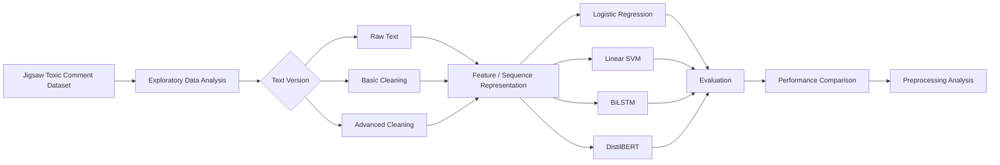

# 🛡️ Toxic Comment Detection

### Evaluating the Impact of Text Preprocessing Across Machine Learning, Deep Learning & Transformer Models

<p align="center">
  <strong>Raw Text vs. Cleaned Text • Multi-Label Classification • Model Comparison</strong>
</p>

---

## 🌐 Overview

Online platforms generate enormous amounts of user-written content, making automatic detection of toxic language increasingly important.

This project explores **multi-label toxic comment classification** using the **Jigsaw Toxic Comment Classification dataset**, with a particular focus on how different **text preprocessing strategies affect different model architectures**.

Rather than evaluating model accuracy alone, the experiments compare:

* 🧹 Raw and preprocessed text
* 🤖 Traditional Machine Learning models
* 🧠 Deep Learning
* 🤗 Transformer-based NLP
* 📊 Classification performance
* ⚡ Computational efficiency

The study evaluates **Logistic Regression, Support Vector Machine (SVM), BiLSTM, and DistilBERT** under a consistent experimental setup.

---

## 🎯 Objectives

* Compare traditional ML, deep learning, and transformer-based approaches.
* Investigate the effect of different preprocessing techniques.
* Determine whether raw or cleaned text performs better for different architectures.
* Compare models using accuracy, precision, recall, Macro F1-score, and computational time.

---

## 🔄 Experimental Workflow



---

## 📚 Dataset

The project uses the **Jigsaw Toxic Comment Classification dataset**, containing English Wikipedia comments with multiple toxicity annotations.

### Toxicity Categories

| Label              | Description          |
| ------------------ | -------------------- |
| ☠️ `toxic`         | Toxic language       |
| ⚠️ `severe_toxic`  | Severe toxicity      |
| 🔞 `obscene`       | Obscene content      |
| 🚨 `threat`        | Threatening language |
| 💢 `insult`        | Insulting language   |
| 🛑 `identity_hate` | Identity-based hate  |

The dataset contains **160,000 training rows** and **465,899 rows in total**, with six toxicity labels in the main classification setup.

---

## 🧹 Text Preprocessing

Three text representations were investigated:

### 1. Raw Text

Original comments without additional cleaning.

### 2. Basic Cleaning

* Lowercasing
* URL removal
* User mention removal
* Punctuation removal
* Extra whitespace removal

### 3. Advanced Cleaning

* Emoji-to-text conversion
* Contraction expansion
* Obscene-word normalization
* Repeated-character normalization
* Tokenization
* Stopword removal
* Lemmatization

---

## 🤖 Models

### Traditional Machine Learning

**Logistic Regression**

TF-IDF features are passed to a Logistic Regression classifier for multi-label toxicity prediction.

**Support Vector Machine**

A linear SVM is used with TF-IDF representations, making it suitable for the high-dimensional sparse feature space produced by text vectorization.

### 🧠 Deep Learning

**Bidirectional LSTM**

```text
Input Text
    ↓
Tokenization & Padding
    ↓
Embedding Layer
    ↓
Bidirectional LSTM
    ↓
Global Max Pooling
    ↓
Dense Layer
    ↓
Dropout
    ↓
Sigmoid Output
    ↓
Multi-Label Prediction
```

The BiLSTM processes sequences in both directions to capture contextual relationships within comments.

### 🤗 Transformer

**DistilBERT**

```text
Raw Text
   ↓
BERT Tokenizer
   ↓
Input IDs + Attention Masks
   ↓
DistilBERT Encoder
   ↓
Contextual Embeddings
   ↓
Classification Head
   ↓
Sigmoid
   ↓
Multi-Label Prediction
```

DistilBERT was fine-tuned for the multi-label toxicity classification task.

---

## 📊 Results

| Model                   |   Accuracy | Precision |     Recall |   Macro F1 | Time (s) |
| ----------------------- | ---------: | --------: | ---------: | ---------: | -------: |
| TF-IDF + LR — Raw       |     92.04% |    83.66% |     39.36% |     0.5099 |     17.9 |
| TF-IDF + LR — Advanced  |     91.89% |    75.85% |     38.45% |     0.4852 |     11.3 |
| **TF-IDF + SVM — Raw**  | **92.09%** |    74.76% | **50.65%** | **0.5944** | **12.7** |
| TF-IDF + SVM — Advanced |     91.87% |    71.93% |     49.57% |     0.5780 |      6.6 |
| BiLSTM — Advanced       |     91.75% |    46.87% |     44.16% |     0.4499 |     93.9 |
| BiLSTM — Raw            |     91.76% |    48.46% |     39.73% |     0.4150 |     47.0 |
| DistilBERT — Raw        |     91.72% |    48.49% |     40.29% |     0.4377 |   1271.3 |

*Reported experimental results from the project evaluation.*

### 🏆 Best Overall Result

> **TF-IDF + Linear SVM trained on raw text**

**92.09% Accuracy**
**0.5944 Macro F1-score**
**12.7 seconds**

The experiments found that the traditional SVM approach outperformed the evaluated deep learning and transformer approaches under the given experimental conditions.

---

## 💡 Key Findings

### Raw text isn't always worse

An important observation was that preprocessing did **not** universally improve performance.

For Logistic Regression and SVM, raw text produced better Macro F1-scores. Removing punctuation, informal expressions, and other lexical patterns could eliminate useful discriminative information for TF-IDF-based models.

BiLSTM showed the opposite behavior: its cleaned-text version performed better than its raw-text counterpart.

### ⚡ Accuracy isn't the whole story

Although several models achieved accuracy around 91–92%, their Macro F1-scores differed substantially.

This highlights why **Macro F1** is particularly useful when working with imbalanced toxicity categories.

### 🚀 Computational efficiency matters

Traditional ML models required considerably less computation than BiLSTM and DistilBERT. The transformer-based approach provided contextual representations but had substantially higher computational cost in the reported experiments.

---

## 🔍 Error Analysis

The confusion-matrix analysis showed that:

* Majority toxicity classes were easier to classify.
* Minority classes produced more classification errors.
* Ambiguous language caused frequent confusion between toxic and non-toxic comments.
* Rare categories such as `threat` and `identity_hate` were particularly difficult to identify.

---

## 🛠️ Tech Stack

| Category        | Technologies                       |
| --------------- | ---------------------------------- |
| Language        | 🐍 Python                          |
| Environment     | ☁️ Google Colab                    |
| Data Processing | Pandas, NumPy                      |
| NLP             | NLTK, Regex                        |
| ML              | Scikit-learn                       |
| Deep Learning   | TensorFlow / Keras                 |
| Transformer     | PyTorch, Hugging Face Transformers |
| Visualization   | Matplotlib, Seaborn, WordCloud     |

The implementation environment and major libraries are documented in the project report.

---

## 📁 Project Structure

```text
Toxic-Comment-Detection/
│
├── 📓 Comparison.ipynb
├── 📄 README.md
│
├── 📂 data/
│   └── dataset files
│
├── 📂 models/
│   ├── logistic_regression/
│   ├── svm/
│   ├── bilstm/
│   └── distilbert/
│
├── 📂 preprocessing/
│   ├── basic_cleaning
│   └── advanced_cleaning
│
└── 📂 results/
    ├── metrics
    ├── confusion_matrices
    └── visualizations
```

---

## 🚀 Future Improvements

Potential extensions include:

* ⚖️ Class balancing with class weights, SMOTE, or undersampling
* 🔄 Data augmentation
* 🎯 Hyperparameter optimization
* 🤗 Extended transformer fine-tuning
* 🧠 Evaluation of RoBERTa, DeBERTa, or ELECTRA
* 🔗 Ensemble learning
* 💬 Incorporation of conversational context
* 🔎 Explainable AI using SHAP or attention visualization
* 🌍 Multilingual toxic-comment detection
* ⚡ Deployment optimization for real-time moderation

---

## 📌 Takeaway

This project demonstrates that **more complex models do not automatically guarantee better performance**.

Under the evaluated experimental setup, **TF-IDF + SVM achieved the strongest overall performance while remaining computationally efficient**. At the same time, the preprocessing experiments show that the optimal text representation depends strongly on the architecture being used.

---

## 👤 Author

### **Tanisha Taranoon Hridy**

Computer Science & Engineering

Interested in **Machine Learning • Deep Learning • NLP • Data Science**

---

<p align="center">
  ⭐ If you found this project interesting, consider giving the repository a star!
</p>
